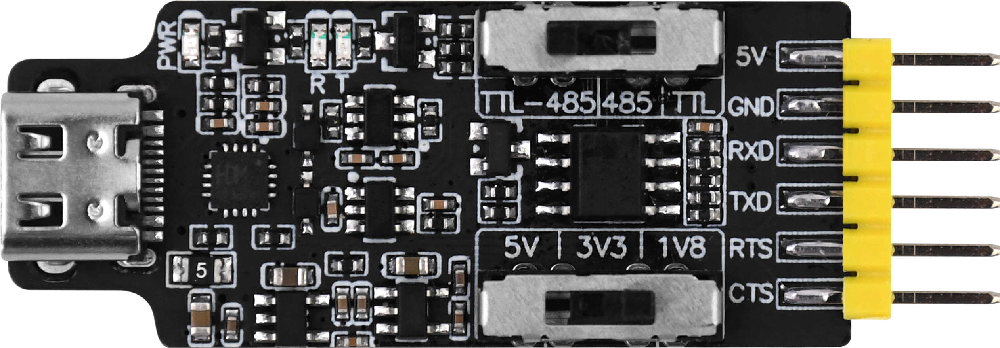
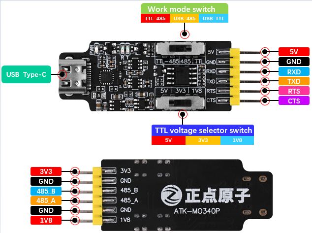
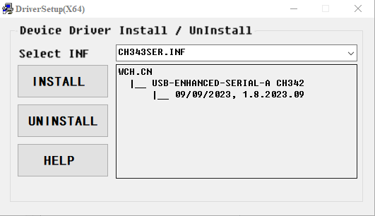
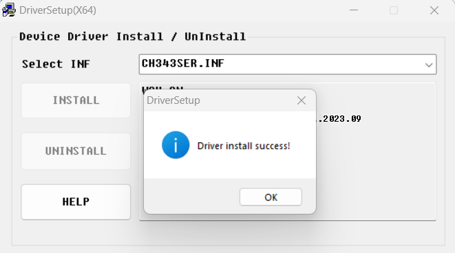
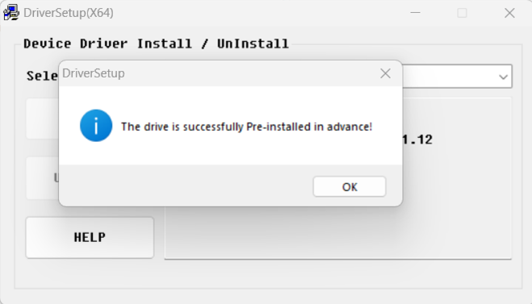
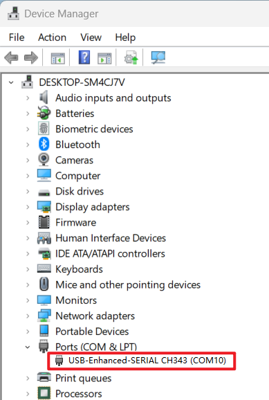
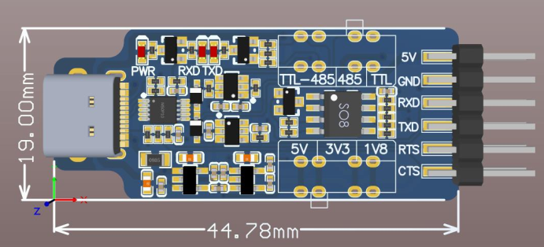

## 1 Introduction

### 1.1 Appearence

### 1.2 Feature and Parameter

ATK-MO340P module is a mini, high performance and multi-function USB to serial port module launched by ALIENTEK.The module uses CH343P as the USB to serial port chip, which can support up to 6Mbps baudrate. The module supports three level phases conversion: USB to TTL, USB to 485 and TTL to 485, three modes of conversion only need to toggle the switch, there is no need for any jumper and cap and other external operation. The module is embedded with high performance level conversion chip, TTL output level can be selected
5V, 3.3V and 1.8V levels, while it can also output 5V, 3.3V and 1.8V voltage. This module has small size, strong performance, convenient in the drive also has excellent compatibility.

The module features are as follows:
* Three modes: USB to TTL, USB to 485 and TTL to 485.
* TTL levels are available for 1.8V, 3.3V and 5V systems for various application scenarios.
* Three kinds of power supply can be provided externally: 1.8V, 3.3V and 5V(Iout(max)=300mA).
* Embedded high performance level conversion chip, TTL level more stable.
* RS485 pure hardware direction switching to solve the direction control problem.
* Three switch switch mode and output voltage, solve jumper trouble.
* Support TTL baud rate:50bps~6Mbps.
* Support 485 baud rate:250kbps(max).
* Supports Windows/Linux/MAC/Android driver, good compatibility.
* Come with communication light, send and receive data at a glance.
* Comes with power indicator.
* Provide two additional control signals (RTS, CTS), good expansibility.
* Comes with 500mA self recovery fuse, safe and reliable.
* Universal USB Type-C interface, support positive and negative dual plug.

The detailed module parameters are as follows:

| Item                      | Description                                        | 
|-------------------------- | -------------------------------------------------- | 
| Interface Type            | Standard USB Type-C port, supporting dual plug     |
| Communication Interface   | Supports TTL and RS485 levels                      |
| Supply Voltage            | 5V(USB power supply)                               |
| Control Interface         | RTS (Output control), CTS (Input control)          |
| Output Voltage            | 1.8V/3.3V/5V    (Iout(max) =300mA)      |
| Compatibility             | Windows/Linux/MAC/Android                          |
| Baudrate                  | TTL:  50bps~6Mbps  RS485: 250kbps               |
| Operating Temperature     | -20°C ~ 70°C                                       |
| Module Size               | 44.78mm * 19mm                                     |

### 1.3 Interface

#### 1.3.1 Pin Description

| Name         | Description         | Comment    |
|------------- | ------------------- | ---------- |
| USB Type-C   | Power supply, USB communication   interface | Support forward and reverse interpolation   |
|Switch        | Working mode switch, three modes are selected as follows: TTL-485: TTL to RS485 mode  USB-485: USB to RS485 mode  USB-TTL: USB to TTL mode  | Note that the three modes cannot be used simultaneously|
| TTL voltage selector switch | Three-gear switch, select TTL level: 1.8V, 3.3V and 5V  | USB-TTL/TTL-485 mode only works |
| 5V           | 5V voltage output interface                                            | You can connect 5V to power the module, do not supply power with USB at the same time. Independent of the voltage selection gear.|
| GND          | Power ground       |                   |
| RXD          | TTL mode data receiving pin (connected to TXD of external device)       |                 |
| TXD          | TTL mode data sending pin (connected to RXD of external device)         |                 |
| RTS          | Request send pin, the RTS pin of CH343P                                 |                 |
| CTS          | Clear send pin, CTS pin of CH343P.                                      |                 |
| 3V3          | 3.3V power output interface(Imax=300mA) | Independent of the voltage selection gear|
| GND          | Power ground       |                   |
| 485_B        | Pin B in RS485 mode |                  |
| 485_A        | Pin A in RS485 mode |                  |
| GND          | Power ground       |                   |
| 1V8          | 1.8V power supply output interface(Imax=300mA)| Independent of the voltage selection gear|

### 1.4 Driver Installation

ATK-MO340P module can select mode and output voltage without any flying wires.You must install the module driver to use it. The driver is available in [drivers](./drivers) folder we have four drivers are provided for your use.

Let's take the example of installing Windows drivers. First double-click **CH343SER.EXE**, enter the driver installation interface, and select INF file (1/1) by default: **CH343SER.INF**, and finally click Install.

After successful installation, it will prompt **Driver install success!**, so that the driver of the module is completed, as shown in the figure below:

If you are prompted with **The drive is successfully Pre-installed in advance!**, the driver may or may not have been installed. If the COM port is not found in the ``Device Manager`` of the computer, then proceed according to the method in the [Installation_failure_solution](./Installation_failure_solution.md) .

After the driver is installed, use USB Type-C cable to connect the computer and the module, which can be accessed from the ``Device Manager`` of the computer. Find the ``USB-Enhanced-SERIAL CH343 COM port`` corresponding to the category of "Device Manager -> Ports (COM and LPT)", as shown below.

## 2 Size

